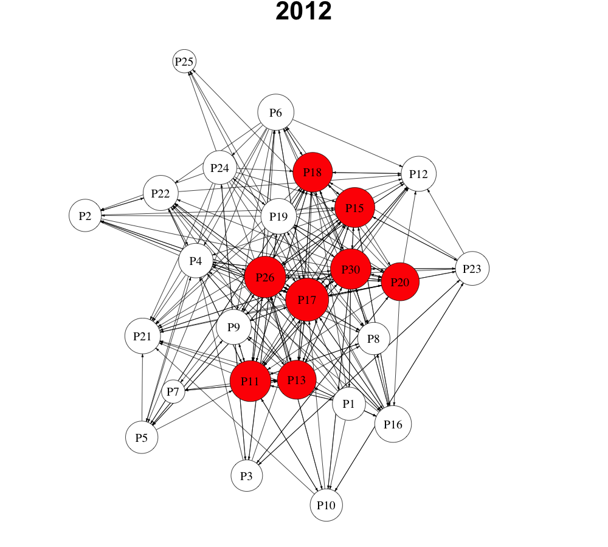
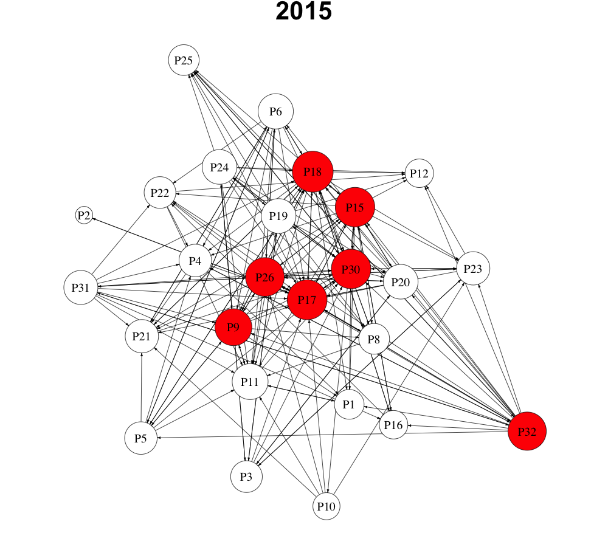

# SAOM (Stochastic Actor Oriented Models)

###### This is a public repository for the article

Juhász, S. and Lengyel, B. (2018): Creation and persistence of ties in cluster knowledge networks. *Journal of Economic Geography*, 18 (6), 1203-1226.

[Abstract]
*Knowledge networks are important to understand learning in industry clusters but surprisingly little is known about what drives the formation, persistence and dissolution of ties. Applying stochastic actor-oriented models on longitudinal relational data from a mature cluster in a medium-tech industry, we show that triadic closure and geographical proximity increase the probability of tie creation but does not influence tie persistence. Cognitive proximity is positively correlated to tie persistence but firms create ties to cognitively proximate firms only if they are loosely connected through common third partners. We propose a micro-perspective to understand how endogenous network effects, cognitive proximity of actors and their interplay influence the evolutionary process of network formation in clusters.* 

## Data

**Networks**

Networks (stored in matrix form) represent knowledge exchange between firms in the printing and paper product cluster of Kecskemét, Hungary.
The following question was used to collect relational data on knowledge sharing in the cluster in both 2012 and 2015:

*If you are in a critical situation and need technical advice, to which of the local firms mentioned in the roster do you turn?*

Therefore, matrices represent advice networks, where companies in rows ask technical advice from companies in columns.
The network consists of 26 nodes (firms) and 223 edges in 2012. 
file: *KNetwork1.csv* 

 After the exit of 2 companies and the entry of 2 new firms, the network consists of 26 nodes and 118 edges in 2015.  
file: *KNetwork2.csv* 
 

**Firm characteritics**

file: *age.csv* - Age (Years in industry or experience) of firms (2012) 
file: *emp.csv* - Number of employees per company (2012) 
file: *export.csv* - Export volume of firms (% of net revenue) (2012) 
file: *ownership.csv*  - Foreign ownership dummy (1=foreign, 0=domestic company) (2012) 
file: *external_ties.csv* - Number of extra-regional knowledge ties (organizations) (2012) 
 

**Similarity (proximity) of firms**

file: *geo_prox_matrix.csv* 
The geographical proximity of firms is measured as the distance of the selected pair of firms subtracted from the maximum physical distance between firms in the cluster (in km). As a result, the variable takes a higher value as the distance between firms diminishes. 

file: *cog_prox_matrix.csv* 
Cognitive proximity is made operational as the number of digits the two firms have in common in their 4-digit NACE codes. 

file: *transtripXcog.csv* 
Number of common third partners multiplied by the cognitive proximity measure of companies. 

## Scripts

file: *_saom_models.R* 
The R script for my SAOM models.

file: *_network_visuals_2012_2015.R* 
The R script to visualize the networks in 2012 and 2015 
 
The knowledge network of the printing and paper product industry in Kecskemét in 2012 and 2015. *Note:* The size of the nodes is proportional to degree. 
  

  

